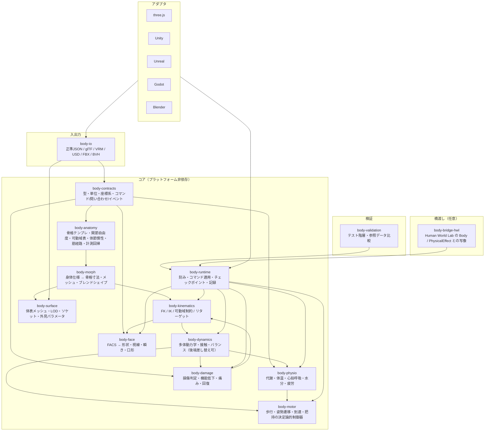

# アーキテクチャ

## 設計原則

1. **正準データ → 計算 → 表示** の一方向。描画エンジンは結果を受け取るだけで、コアの状態を直接変更しない。
2. **固定時間刻みの決定論**。コマンドは刻みの境界で適用し、同じ刻みのコマンドの適用順序が結果を変えない。乱数は親リポジトリと同じキー付き乱数（seed / 対象 / 刻み / 用途）で、表示や問い合わせは乱数を消費しない。
3. **層ごとの版**。契約・解剖データ・各計算層・資産に別々の版を持ち、記録に全部を残す。
4. **忠実度の差し替え**。運動 L1（運動学）と L2（動力学）、生理の有無などは同じ契約の下で実装を切り替える。上位レベルを無効化すると下位レベルと一致する。
5. **既存モデルからの独立**。親リポジトリの `human` / `world` と相互に import しない。接続は橋渡しパッケージで明示する。

## 層と責務



| パッケージ（仮） | 責務 | 入力 | 出力 | 乱数 |
| --- | --- | --- | --- | --- |
| `body-contracts` | 型、単位、座標系、`BodySpec`、`Skeleton`、`JointState`、`BodyCommand`、`BodyQuery`、`BodyEvent`、`RandomSource`。他パッケージを import しない | – | – | なし |
| `body-anatomy` | 不変の解剖データ。骨格テンプレート（階層・関節種別・自由度）、可動域表、体節慣性パラメータ、筋経路（L3 用）、人体計測の回帰式。全データに出典と根拠区分 | – | 定数・表 | なし |
| `body-morph` | `BodySpec` から骨格寸法・体表メッシュ・ブレンドシェイプ重みを生成 | `BodySpec`、anatomy | `Skeleton`、`SurfaceMesh` | 個体差の生成のみ（シード） |
| `body-kinematics` | FK、IK、可動域制約、姿勢補間、リターゲット。動力学を知らない | `Skeleton`、目標 | `Pose`（関節角度）、ワールド変換、到達可能性 | なし |
| `body-dynamics` | 多体動力学、接触、受動関節特性、バランス。後端を差し替え可能（自前簡易ソルバ / MuJoCo / Rapier / エンジン物理）。後端ごとに結果が異なることを版で区別 | `Skeleton`、慣性、外力、関節トルク | `Pose`、速度、接触力 | なし |
| `body-motor` | 歩行・走行・遷移・到達・把持の制御器。運動 L1 では姿勢列を直接生成、L2 では関節トルク目標を出す。AI ではなく、パラメータ化された決定論的制御 | 目標（速度・位置・把持対象）、現在状態 | 関節目標 / トルク | 微小な揺らぎを出す場合のみ（シード） |
| `body-physio` | 代謝、体温、心拍・呼吸、水分、疲労の粗い常微分方程式。運動量と環境を入力、性能係数を出力 | 運動量、環境、時間 | 生理変数、性能係数（最大トルク倍率など） | なし |
| `body-damage` | 衝撃・荷重 → 損傷判定、機能低下への写像、痛み、回復 | 接触力、荷重履歴、外部設定 | 損傷状態、可動域・筋力の制限、痛みイベント | 判定のばらつきを出す場合のみ（シード） |
| `body-face` | FACS アクションユニットを正準とした表情、視線、瞬き、口形 | AU 目標、視線目標 | ブレンドシェイプ重み、眼・顎のボーン角 | 瞬き間隔のみ（シード） |
| `body-surface` | 体表メッシュ、スキニング、LOD、衣服ソケット、外見パラメータ | 骨格、`Pose`、morph 出力 | 変形後メッシュ、ソケット変換 | なし |
| `body-runtime` | 固定刻みの進行、コマンドキュー、問い合わせ、イベント、チェックポイント、記録 `human-body/run` | コマンド | 状態、イベント、記録 | 各層へキー付き乱数を配る |
| `body-io` | 正準形式の読み書き、glTF / VRM / USD / FBX / BVH への変換。信頼できない入力の検証と上限 | ファイル | コア型 | なし |
| `body-adapters-*` | エンジンごとの読み込み・同期・描画。コアの状態を書き換えない | runtime の状態 | エンジン内オブジェクト | なし |
| `body-validation` | テスト階層 T0〜T5 と参照データ比較（[VALIDATION](VALIDATION.md)） | runtime | 報告 | なし |
| `body-bridge-hwl` | 親リポジトリの `Body` / `PhysicalEffect` との写像（任意・後段） | 両者の状態 | 写像結果 | なし |

## 依存方向

- `body-contracts` ← すべて。contracts は何も import しない。
- `body-anatomy` ← morph, kinematics, dynamics, physio, damage。anatomy は contracts のみ。
- kinematics は dynamics を知らない。dynamics は kinematics の `Pose` 型を使う。
- motor は kinematics と dynamics の契約に依存するが、どちらの実装にも依存しない（L1/L2 切り替え）。
- physio と damage は運動量・接触力を受け取り、性能係数と制限を返す。motor と kinematics はそれを受け取る。循環を避けるため、runtime が刻みごとに「前刻みの生理・損傷出力」を「今刻みの運動入力」へ渡す（親リポジトリの「全員が同じ更新前の世界を観察する」と同じ考え方）。
- adapters と io はコアに依存し、コアは adapters と io に依存しない。
- 既存の `packages/human`, `packages/world`, `packages/simulation` と body-* の間に import はない。橋渡しは `body-bridge-hwl` のみ。

## 一刻みの契約

固定刻み `dt`（既定 1/120 s を工学的仮定として置く。動力学の安定性と 60Hz ゲームでの 2 サブステップを両立する値。B2 で見直す）。

1. **入力の収集**: この刻みに届いたコマンドを集める。適用は刻みの境界でのみ行う。
2. **性能係数の確定**: 前刻みの physio・damage の出力（最大トルク倍率、可動域制限、痛み）を今刻みの入力として固定する。
3. **運動制御**: motor が目標から関節目標（L1: 角度、L2: トルク）を計算する。
4. **姿勢の更新**: L1 では kinematics が可動域内で角度を更新。L2 では dynamics が外力・接触・トルクで積分する。
5. **身体内部の更新**: physio が運動量・環境から生理変数を更新。damage が接触力・荷重から損傷を更新。face が AU 目標へ追従。
6. **表面の更新**: surface が変形メッシュとソケットを計算する（表示用。状態を変えない）。
7. **イベントの発行とチェックポイント**: 接触、転倒、損傷、閾値通過などを `BodyEvent` として出す。必要ならチェックポイントを取る。

同じ刻みの複数コマンドは、宣言された優先順位（外部設定 > 制御目標 > 補助）で解決し、同順位の矛盾は「後勝ち」ではなく**拒否イベント**にする。これにより適用順序が結果を変えない。

## コマンド・問い合わせ・イベント

詳細は [OPERATIONS](OPERATIONS.md)。ここでは型の骨子だけ示す。

```ts
type BodyCommand = {
  id: string;                 // 発行側が付ける一意ID。結果イベントで参照する
  tick?: number;              // 省略時は次の刻み
  domain: "morph" | "pose" | "dynamics" | "motor" | "grasp" | "face" | "physio" | "damage" | "surface" | "runtime";
  name: string;               // 領域内の操作名。OPERATIONS のカタログに一致
  params: Record<string, unknown>; // 単位は契約で固定（SI、ラジアン）
};

type BodyQuery = { domain: string; name: string; params?: Record<string, unknown> };

type BodyEvent = {
  tick: number;
  kind: "accepted" | "rejected" | "contact" | "fall" | "injury" | "pain" | "threshold" | "reach" | "grasp" | "custom";
  commandId?: string;
  payload: Record<string, unknown>;
};
```

## 状態の所有者

| 状態 | 所有者 | 外部から直接書けるか |
| --- | --- | --- |
| 身体仕様、骨格寸法、メッシュ | morph（生成後は不変） | 再生成コマンドのみ |
| 関節角度・速度 | L1: kinematics、L2: dynamics | L1 では `pose.set*` で可。L2 では外力・トルクを通じてのみ（デバッグ用の直接設定は記録に印を付ける） |
| 生理変数 | physio | 設定コマンドで可（実験条件として記録） |
| 損傷状態 | damage | 設定コマンドで可（FR-DMG-05） |
| 表情・視線 | face | 目標の設定で可 |
| 変形メッシュ、ソケット | surface | 不可（表示専用） |
| 記録、チェックポイント | runtime | 保存・復元のみ |

## 忠実度の切り替え

`BodyConfig.fidelity = { morph: 0..4, motion: 0..4, physio: 0..4, response: 0..4 }` を実行開始時に固定し、記録に残す。切り替えは「上位レベルの層を無効化し、下位レベルの既定値を使う」で実装する。無効化した層のキーは出力に残し、値を 0 または既定にする（親リポジトリの寄与無効の対照と同じ扱い。記録の形が変わらないので比較しやすい）。

## 既存モデルとの橋渡し

親リポジトリの `Body = { hunger, fatigue, cold, health }` と `PhysicalEffect = { ambientCold, foodIntake, exertion, resting, collision }` は抽象単位である。橋渡し `body-bridge-hwl` は次を**明示的な写像表**として持つ。

| Human World Lab 側 | body track 側 | 写像の性質 |
| --- | --- | --- |
| `PhysicalEffect.exertion` | motor / dynamics の機械的仕事率 → physio の代謝率 | 単位変換（抽象 → W/kg）。係数は工学的仮定 |
| `PhysicalEffect.collision` | damage への接触力 | 閾値と尺度は工学的仮定 |
| `PhysicalEffect.ambientCold` | physio の環境温・風・放射 | 抽象寒度 → ℃ 相当。係数は工学的仮定 |
| `Body.fatigue` | physio の疲労区画 | 0〜1 への正規化 |
| `Body.cold` | physio の深部温・皮膚温からの偏差 | 正規化 |
| `Body.health` | damage の総合機能率と physio の生理ストレス | 正規化 |
| 認知モデルへの知覚 | 痛み、疲労感、温冷感、固有受容（関節角・接触） | 本人の身体のみ。他者の身体内部は渡さない |

橋渡しを有効にした実験は、親リポジトリの world/simulation の版とは別に `body-bridge-hwl` の版を記録する。親リポジトリの既定モデルの挙動は変えない。接続は B4 以降の任意項目である。

## 実装言語と実行環境

- 初版は TypeScript（親リポジトリと同じ `node --experimental-strip-types` で CLI とテストを実行）。
- `body-dynamics` の後端は契約を先に決め、B2 で自前簡易ソルバ（教育・検証用）と既存エンジン（MuJoCo の WASM ビルド、Rapier など）を比較して選ぶ。後端ごとに結果が異なるため、記録には後端の名前と版を残す。
- WASM 化・ネイティブ化は、契約の安定後に性能要件（NFR-02）で判断する。

## ディレクトリ案

```
packages/
  body-contracts/      body-anatomy/        body-morph/
  body-kinematics/     body-dynamics/       body-motor/
  body-physio/         body-damage/         body-face/
  body-surface/        body-runtime/        body-io/
  body-validation/     body-bridge-hwl/
adapters/
  three/  unity/  unreal/  godot/  blender/
assets/body/
  base-mesh/  rig/  blendshapes/  LICENSES/
cli/body-*.ts
tests/body/
docs/body/
```

既存の `packages/*` と同じワークスペースで始め、公開時に別リポジトリへ切り出す（[ADR 0002](../decisions/0002-body-track.md)）。
